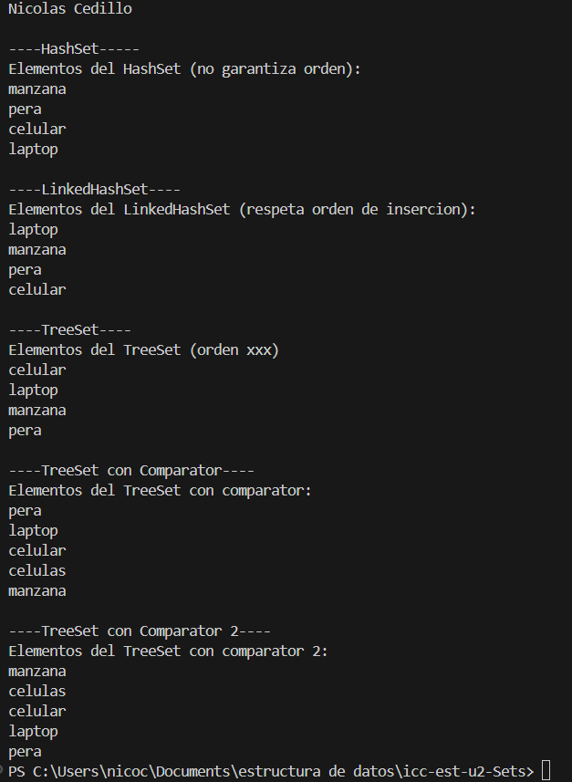

# Sets

## 📌 Información General

- **Título:** Sets
- **Asignatura:** Estructura de Datos
- **Carrera:** Computación
- **Estudiante:** Nicolás Cedillo
- **Fecha:** 1 de julio de 2025
- **Profesor:** Ing. Pablo Torres

---

## 🛠️ Descripción

Se implementa funciones para entender la logica de los Sets
- HashSet
- LinkedHashSet
- TreeSet
- TreeSet con el comparador

En la clase **Sets** se tiene diferentes métodos para construir los diferentes tipos de sets.
Los 2 últimos tienen un diferente comparator.


En el **Main** tenemos 4 métodos estáticos que nos imprimen los resultados de cada tipo de set.

---

## 🚀 Ejecución

Para ejecutar el proyecto:

1. Compila el código:
    ```bash
    javac App.java
    ```
2. Ejecuta la aplicación:
    ```bash
    java App
    ```

---

## Imagen




